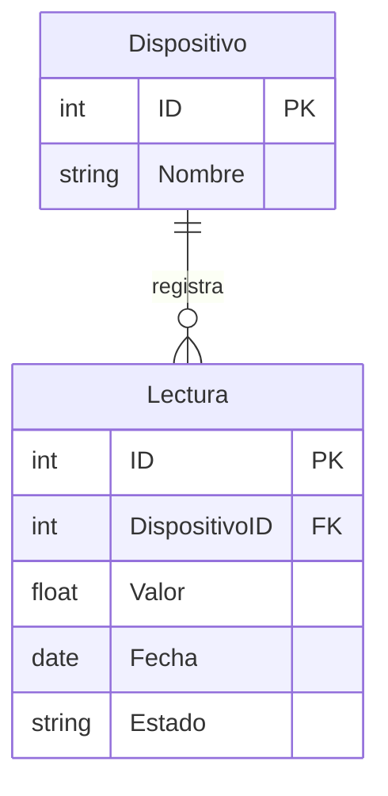

# Proyecto de Investigación: Comparativa de Rendimiento - Relacional vs No Relacional

**Alumno:** Oleksiy Mumzhu

## 1. Introducción y Selección de Bases de Datos
Este proyecto tiene como objetivo analizar y comparar el comportamiento, rendimiento y escalabilidad de dos paradigmas de bases de datos bajo diferentes situaciones de estrés. 

Se seleccionaron las siguientes tecnologías:
* **Base de Datos Relacional (SQL): MySQL.** Elegida por su madurez en el mercado, su cumplimiento estricto de las propiedades ACID y su motor optimizado para cruzar tablas fuertemente estructuradas.
* **Base de Datos No Relacional (NoSQL): MongoDB.** Elegida por su popularidad como base de datos orientada a documentos (BSON), su esquema flexible y su capacidad teórica para escalar horizontalmente en escenarios analíticos.

## 2. Modelo de Datos y Entidades
Para realizar las pruebas, se definió un modelo de datos simulando un entorno de "Internet de las Cosas" (IoT), donde múltiples sensores envían datos constantemente. Se establecieron dos entidades con una relación de **Uno a Muchos (1:N)**.

* **Entidad 1: Dispositivo** (Almacena el catálogo de sensores).
  * Columnas/Campos: `ID` (Primary Key), `Nombre`.
* **Entidad 2: Lectura** (Almacena el historial de métricas registradas).
  * Columnas/Campos: `ID` (Primary Key), `DispositivoID` (Foreign Key), `Valor`, `Fecha`, `Estado`.

## 3. Metodología y Parámetros de Evaluación
Para comprobar cómo se ve afectado el rendimiento al crecer la información, se cargaron tres cantidades de datos sintéticos en ambos motores:
1. **10,000** (Diez mil registros) - Escenario de prueba inicial.
2. **1,000,000** (Un millón de registros) - Escenario de carga media.
3. **100,000,000** (Cien millones de registros) - Escenario de Big Data / Estrés extremo.

**Parámetros evaluados:**
* **Tiempo de respuesta (Ejecución):** Medido en milisegundos/segundos/minutos, evaluando cuánto tarda el motor en resolver la consulta.
* **Espacio de almacenamiento:** Medido en Megabytes (MB) para determinar la eficiencia de compresión en disco de cada tecnología.

## 4. Consultas de Prueba
Se diseñaron 5 consultas específicas para abarcar distintos casos de uso.

**1. Consulta de Cruce (INNER JOIN / Lookup)**
* **MySQL:** `SELECT * FROM Dispositivo d INNER JOIN Lectura l ON d.ID = l.DispositivoID WHERE d.ID = 16649998;`
* **MongoDB:** `db.dispositivo.aggregate([{ $match: { ID: 16649998 } }, { $lookup: { from: "lectura", localField: "ID", foreignField: "DispositivoID", as: "historial" } }]);`

**2. Actualización Masiva (UPDATE / updateMany)**
* **MySQL:** `UPDATE Lectura SET Estado = 'Revisado' WHERE Fecha = '2026-03-27';`
* **MongoDB:** `db.lectura.updateMany({ Fecha: "2026-03-27" }, { $set: { Estado: "Revisado" } });`

**3. Creación de Índices**
* **MySQL:** `CREATE INDEX idx_fecha ON Lectura(Fecha);`
* **MongoDB:** `db.lectura.createIndex({ Fecha: 1 });`

**4. Borrado Masivo (DELETE / deleteMany)**
* **MySQL:** `DELETE FROM Lectura WHERE Estado = 'Activo';`
* **MongoDB:** `db.lectura.deleteMany({ Estado: "Activo" });`

**5. Agrupación Matemática (AVG total) (Solo 100 millones)**
* **MySQL:** `SELECT DispositivoID, COUNT(*) as TotalLecturas, AVG(Valor) as Promedio FROM Lectura GROUP BY DispositivoID;`
* **MongoDB:** `db.lectura.aggregate([{ $group: { _id: "$DispositivoID", TotalLecturas: { $sum: 1 }, Promedio: { $avg: "$Valor" } } }]);`
# Proyecto de Investigación: Comparativa de Rendimiento - Relacional vs No Relacional

**Alumno:** Oleksiy Mumzhu

## 1. Introducción y Selección de Bases de Datos
Este proyecto tiene como objetivo analizar y comparar el comportamiento, rendimiento y escalabilidad de dos paradigmas de bases de datos bajo diferentes situaciones de estrés. 

Se seleccionaron las siguientes tecnologías:
* **Base de Datos Relacional (SQL): MySQL.** Elegida por su madurez en el mercado, su cumplimiento estricto de las propiedades ACID y su motor optimizado para cruzar tablas fuertemente estructuradas.
* **Base de Datos No Relacional (NoSQL): MongoDB.** Elegida por su popularidad como base de datos orientada a documentos (BSON), su esquema flexible y su capacidad teórica para escalar horizontalmente en escenarios analíticos.

## 2. Modelo de Datos y Entidades
Para realizar las pruebas, se definió un modelo de datos simulando un entorno de "Internet de las Cosas" (IoT), donde múltiples sensores envían datos constantemente. Se establecieron dos entidades con una relación de **Uno a Muchos (1:N)**.

* **Entidad 1: Dispositivo** (Almacena el catálogo de sensores).
  * Columnas/Campos: `ID` (Primary Key), `Nombre`.
* **Entidad 2: Lectura** (Almacena el historial de métricas registradas).
  * Columnas/Campos: `ID` (Primary Key), `DispositivoID` (Foreign Key), `Valor`, `Fecha`, `Estado`.

## 3. Metodología y Parámetros de Evaluación
Para comprobar cómo se ve afectado el rendimiento al crecer la información, se cargaron tres cantidades de datos sintéticos en ambos motores:
1. **10,000** (Diez mil registros) - Escenario de prueba inicial.
2. **1,000,000** (Un millón de registros) - Escenario de carga media.
3. **100,000,000** (Cien millones de registros) - Escenario de Big Data / Estrés extremo.

**Parámetros evaluados:**
* **Tiempo de respuesta (Ejecución):** Medido en milisegundos/segundos/minutos, evaluando cuánto tarda el motor en resolver la consulta.
* **Espacio de almacenamiento:** Medido en Megabytes (MB) para determinar la eficiencia de compresión en disco de cada tecnología.

## 4. Consultas de Prueba
Se diseñaron 6 consultas específicas para abarcar distintos casos de uso.

**1. Consulta de Cruce (INNER JOIN / Lookup)**
* **MySQL:** `SELECT * FROM Dispositivo d INNER JOIN Lectura l ON d.ID = l.DispositivoID WHERE d.ID = 16649998;`
* **MongoDB:** `db.dispositivo.aggregate([{ $match: { ID: 16649998 } }, { $lookup: { from: "lectura", localField: "ID", foreignField: "DispositivoID", as: "historial" } }]);`

**2. Actualización Masiva (UPDATE / updateMany)**
* **MySQL:** `UPDATE Lectura SET Estado = 'Revisado' WHERE Fecha = '2026-03-27';`
* **MongoDB:** `db.lectura.updateMany({ Fecha: "2026-03-27" }, { $set: { Estado: "Revisado" } });`

**3. Creación de Índices**
* **MySQL:** `CREATE INDEX idx_fecha ON Lectura(Fecha);`
* **MongoDB:** `db.lectura.createIndex({ Fecha: 1 });`

**4. Borrado Masivo (DELETE / deleteMany)**
* **MySQL:** `DELETE FROM Lectura WHERE Estado = 'Activo';`
* **MongoDB:** `db.lectura.deleteMany({ Estado: "Activo" });`

**5. Agrupación Matemática (AVG total)**
* **MySQL:** `SELECT DispositivoID, COUNT(*) as TotalLecturas, AVG(Valor) as Promedio FROM Lectura GROUP BY DispositivoID;`
* **MongoDB:** `db.lectura.aggregate([{ $group: { _id: "$DispositivoID", TotalLecturas: { $sum: 1 }, Promedio: { $avg: "$Valor" } } }]);`

**6. Cruce Analítico Masivo (JOIN Total sin filtros)**
* **MySQL:** `SELECT d.Nombre, AVG(l.Valor) as Promedio FROM Dispositivo d INNER JOIN Lectura l ON d.ID = l.DispositivoID GROUP BY d.ID, d.Nombre ORDER BY Promedio DESC LIMIT 5;`
* **MongoDB:** `db.dispositivo.aggregate([ { $lookup: { from: "lectura", localField: "ID", foreignField: "DispositivoID", as: "historial" } }, { $unwind: "$historial" }, { $group: { _id: "$Nombre", Promedio: { $avg: "$historial.Valor" } } }, { $sort: { Promedio: -1 } }, { $limit: 5 } ], { allowDiskUse: true });`

## 5. Resultados de Rendimiento

| Operación Evaluada | MySQL (10 Mil) | MongoDB (10 Mil) | MySQL (1 Millón) | MongoDB (1 Millón) | MySQL (100 Millones) | MongoDB (100 Millones) |
| :--- | :--- | :--- | :--- | :--- | :--- | :--- |
| **1. Cruce (JOIN específico)** | < 5 ms | < 5 ms | 9 ms | 76 ms | 18 ms | 140 ms |
| **2. Actualización masiva** | < 15 ms | < 15 ms | 4.28 s | 3.99 s | 6 min 44 s | 6 min 43 s |
| **3. Creación de Índice** | < 20 ms | < 20 ms | 567 ms | 921 ms | 45.91 s | 1 min 33 s |
| **4. Borrado masivo** | < 10 ms | < 10 ms | 261 ms | 472 ms | 23.16 s | 39.39 s |
| **5. Agrupación Matemática** | < 10 ms | < 10 ms | - | - | 3 horas 5 min | 1 hora 52 min |
| **6. Cruce Analítico Masivo** | < 15 ms | < 20 ms | - | - | 6 ms *(Abortado)* | +13 horas *(Colapso)* |
| **7. Espacio en Disco** | ~1.5 MB | ~2.5 MB | 61.11 MB | 78.59 MB | 5958.00 MB | 5482.85 MB |

## 6. Conclusiones

1. **Gestión de Relaciones (JOINs):** MySQL es inmensamente superior al cruzar entidades. En 100 millones de registros, resolvió un JOIN con filtros en 18 ms. En la prueba de estrés extremo (Cruce Analítico Masivo), el optimizador de MySQL abortó inteligentemente la operación en 6 ms al detectar el desbordamiento, mientras que el `$lookup` de MongoDB agotó los recursos de hardware colapsando tras más de 13 horas. Esto demuestra que los datos en NoSQL deben diseñarse de forma anidada desde el inicio.
2. **Procesamiento Analítico y Paralelismo:** MongoDB superó a MySQL calculando promedios masivos (1h 52m vs 3h 5m). Su *Aggregation Pipeline* divide la carga en múltiples hilos de CPU, mientras MySQL procesa secuencialmente en un hilo.
3. **Escritura y Cuellos de Botella (I/O):** En actualizaciones masivas, ambos empataron (~6m 44s). Bajo escaneos completos, el límite físico es la velocidad de escritura del disco, anulando cualquier ventaja del motor.
4. **Eficiencia de Almacenamiento:** Aunque los documentos BSON ocupan más espacio unitario, a escala de Big Data el motor WiredTiger de MongoDB aplicó mejor compresión. En 100 millones de registros, ocupó un 8% menos de disco (5.48 GB) que MySQL (5.95 GB).