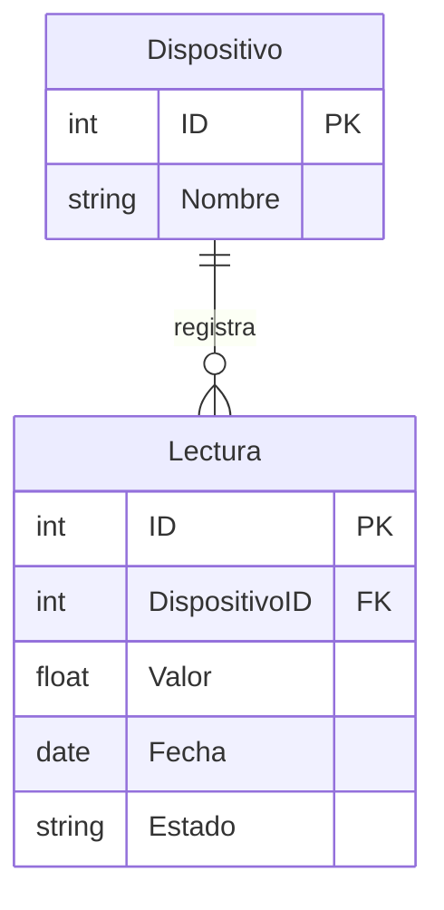

# Proyecto de Investigación: Comparativa de Rendimiento - Relacional vs No Relacional

**Alumno:** Oleksiy Mumzhu

## 1. Introducción y Selección de Bases de Datos
Este proyecto tiene como objetivo analizar y comparar el comportamiento, rendimiento y escalabilidad de dos paradigmas de bases de datos bajo diferentes situaciones de estrés. 

Se seleccionaron las siguientes tecnologías:
* **Base de Datos Relacional (SQL): MySQL.** Elegida por su madurez en el mercado, su cumplimiento estricto de las propiedades ACID y su motor optimizado para cruzar tablas fuertemente estructuradas.
* **Base de Datos No Relacional (NoSQL): MongoDB.** Elegida por su popularidad como base de datos orientada a documentos (BSON), su esquema flexible y su capacidad teórica para escalar horizontalmente en escenarios analíticos.

## 2. Modelo de Datos y Entidades
Para realizar las pruebas, se definió un modelo de datos simulando un entorno de "Internet de las Cosas" (IoT), donde múltiples sensores envían datos constantemente. Se establecieron dos entidades con una relación de **Uno a Muchos (1:N)**.

* **Entidad 1: Dispositivo** (Almacena el catálogo de sensores).
  * Columnas/Campos: `ID` (Primary Key), `Nombre`.
* **Entidad 2: Lectura** (Almacena el historial de métricas registradas).
  * Columnas/Campos: `ID` (Primary Key), `DispositivoID` (Foreign Key), `Valor`, `Fecha`, `Estado`.

