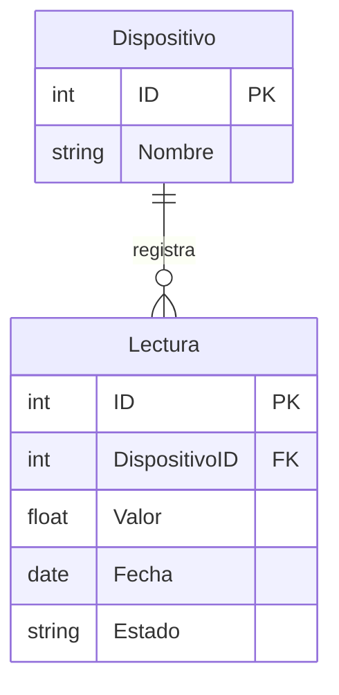

# Proyecto de Investigación: Comparativa de Rendimiento - Relacional vs No Relacional

**Alumno:** Oleksiy Mumzhu

## 1. Introducción y Selección de Bases de Datos
Este proyecto tiene como objetivo analizar y comparar el comportamiento, rendimiento y escalabilidad de dos paradigmas de bases de datos bajo diferentes situaciones de estrés. 

Se seleccionaron las siguientes tecnologías:
* **Base de Datos Relacional (SQL): MySQL.** Elegida por su madurez en el mercado, su cumplimiento estricto de las propiedades ACID y su motor optimizado para cruzar tablas fuertemente estructuradas.
* **Base de Datos No Relacional (NoSQL): MongoDB.** Elegida por su popularidad como base de datos orientada a documentos (BSON), su esquema flexible y su capacidad teórica para escalar horizontalmente en escenarios analíticos.

## 2. Modelo de Datos y Entidades
Para realizar las pruebas, se definió un modelo de datos simulando un entorno de "Internet de las Cosas" (IoT), donde múltiples sensores envían datos constantemente. Se establecieron dos entidades con una relación de **Uno a Muchos (1:N)**.

* **Entidad 1: Dispositivo** (Almacena el catálogo de sensores).
  * Columnas/Campos: `ID` (Primary Key), `Nombre`.
* **Entidad 2: Lectura** (Almacena el historial de métricas registradas).
  * Columnas/Campos: `ID` (Primary Key), `DispositivoID` (Foreign Key), `Valor`, `Fecha`, `Estado`.

## 3. Metodología y Parámetros de Evaluación
Para comprobar cómo se ve afectado el rendimiento al crecer la información, se cargaron tres cantidades de datos sintéticos en ambos motores:
1. **10,000** (Diez mil registros) - Escenario de prueba inicial.
2. **1,000,000** (Un millón de registros) - Escenario de carga media.
3. **100,000,000** (Cien millones de registros) - Escenario de Big Data / Estrés extremo.

**Parámetros evaluados:**
* **Tiempo de respuesta (Ejecución):** Medido en milisegundos/segundos/minutos, evaluando cuánto tarda el motor en resolver la consulta.
* **Espacio de almacenamiento:** Medido en Megabytes (MB) para determinar la eficiencia de compresión en disco de cada tecnología.

## 4. Consultas de Prueba
Se diseñaron 5 consultas específicas para abarcar distintos casos de uso.

**1. Consulta de Cruce (INNER JOIN / Lookup)**
* **MySQL:** `SELECT * FROM Dispositivo d INNER JOIN Lectura l ON d.ID = l.DispositivoID WHERE d.ID = 16649998;`
* **MongoDB:** `db.dispositivo.aggregate([{ $match: { ID: 16649998 } }, { $lookup: { from: "lectura", localField: "ID", foreignField: "DispositivoID", as: "historial" } }]);`

**2. Actualización Masiva (UPDATE / updateMany)**
* **MySQL:** `UPDATE Lectura SET Estado = 'Revisado' WHERE Fecha = '2026-03-27';`
* **MongoDB:** `db.lectura.updateMany({ Fecha: "2026-03-27" }, { $set: { Estado: "Revisado" } });`

**3. Creación de Índices**
* **MySQL:** `CREATE INDEX idx_fecha ON Lectura(Fecha);`
* **MongoDB:** `db.lectura.createIndex({ Fecha: 1 });`

**4. Borrado Masivo (DELETE / deleteMany)**
* **MySQL:** `DELETE FROM Lectura WHERE Estado = 'Activo';`
* **MongoDB:** `db.lectura.deleteMany({ Estado: "Activo" });`

**5. Agrupación Matemática (AVG total) (Solo 100 millones)**
* **MySQL:** `SELECT DispositivoID, COUNT(*) as TotalLecturas, AVG(Valor) as Promedio FROM Lectura GROUP BY DispositivoID;`
* **MongoDB:** `db.lectura.aggregate([{ $group: { _id: "$DispositivoID", TotalLecturas: { $sum: 1 }, Promedio: { $avg: "$Valor" } } }]);`
